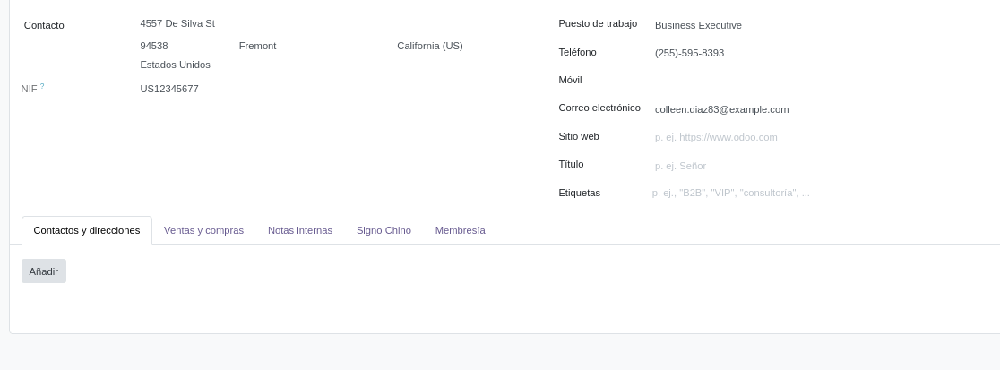
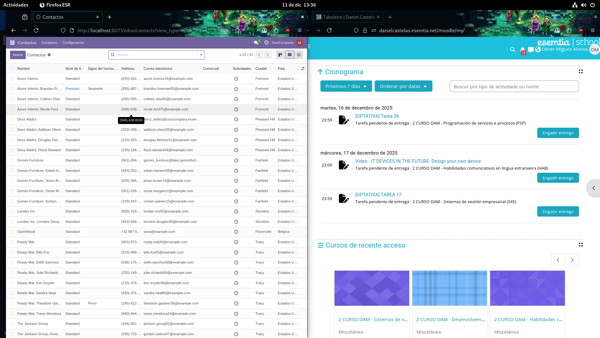
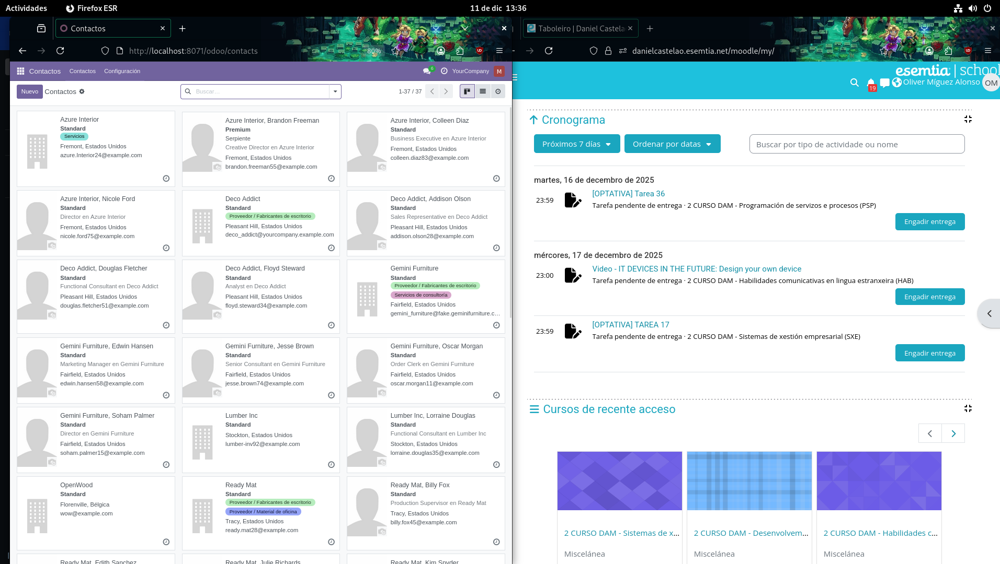

# Tarea 16 SXE

## Resultado de nuestro módulo 

Podemos observar como gracias al módulo que e creado
se generó nuevas pestañas para introducir el año y que calcule automaticamente el signo chino

Ademas también se puede observar el tipo de membresía de cada uno de los contactos.

Por último mencionar el cambio de color de la membresía en la vista Kanban

